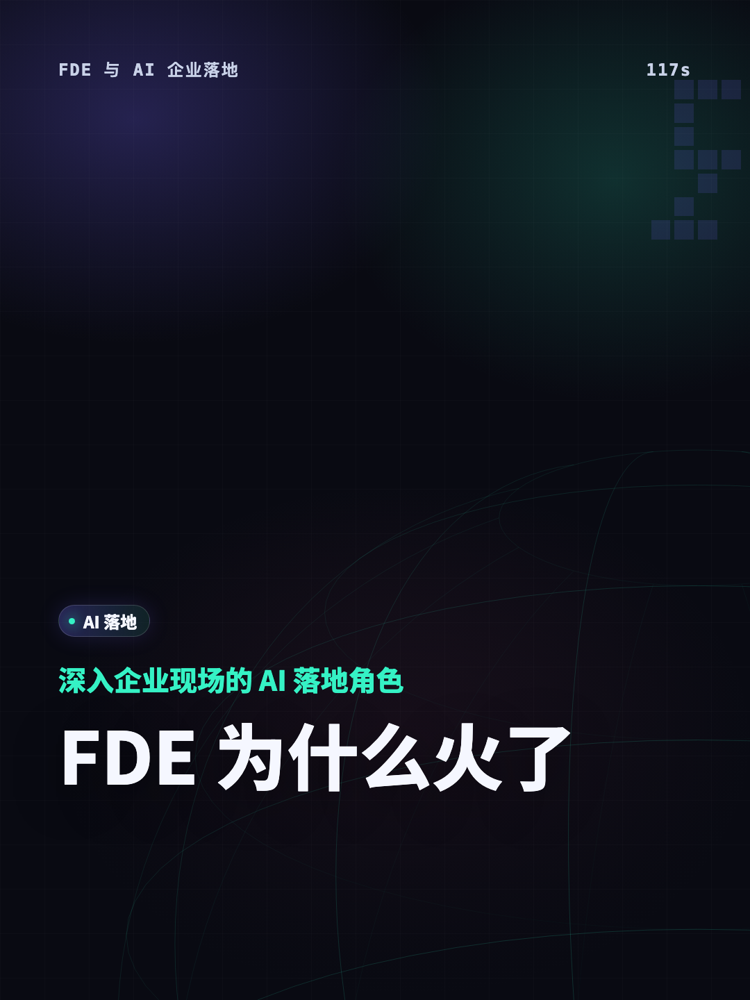
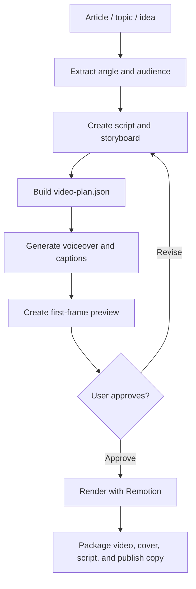

# Short Video Maker

[中文](./README.zh.md) | English

Turn an article, topic, or rough idea into a narrated vertical short-video package for Xiaohongshu, Douyin, TikTok-style explainers, and other social platforms.

This skill is designed to be portable across Codex, Claude Code, and OpenClaw. The active agent handles research, analysis, script writing, and storyboarding; the bundled Node and Remotion workflow handles validation, TTS synchronization, captions, first-frame preview, rendering, cover export, and packaging.

Use it when you want to turn an article, topic, course fragment, or opinion brief into a short-video package with narration, captions, a cover image, and publish copy. The current workflow is strongest for Chinese knowledge explainers, opinion breakdowns, and tool-method videos.

Compatible with Codex, Claude Code, and OpenClaw as an agent skill. The local rendering workflow requires Node.js, FFmpeg, and Remotion.

## Preview



## Core Capabilities

| Capability | What it helps you do |
|---|---|
| Short-video planning | Extract a focused angle, audience, and narrative structure from an article, topic, or rough idea |
| Script and storyboard | Create narration, scene titles, screen text, visual direction, motion, and transition plans |
| TTS and caption sync | Generate or connect narration audio, then align captions, scenes, and the video timeline |
| Remotion rendering | Render video, first-frame previews, and covers from a structured `video-plan.json` |
| Publish package | Export video, cover, script, captions, platform title, body copy, tags, and metadata |
| Quality checks | Validate plan structure, timing, audio duration, caption readability, and publish readiness |

## How It Works



The agent handles creative judgment: research, angle selection, scripting, and storyboard planning. The local scripts handle repeatable execution: validation, TTS sync, captions, preview, rendering, quality checks, and packaging.

## Design Boundary

This skill borrows quality gates, pronunciation dictionaries, preference files, platform rules, and timing audits from heavier video-podcast workflows, but it stays short-video first:

- The main path remains a 90-130 second vertical short video.
- Long articles, long narration scripts, or `podcast.txt` inputs should first be reduced to one strong short-video angle.
- Full long-form podcasts, Bilibili/YouTube 4K production, batch production, and automatic publishing are out of scope for this skill.

## Who Should Use It

Use this skill when you want an agent to produce a complete short-video workflow from a source article, topic, or idea:

- Chinese knowledge explainers and opinion videos
- Xiaohongshu and Douyin vertical videos
- Narrated videos with captions, cover image, and publish copy
- Agent-assisted video planning where rendering should stay deterministic

Do not use it as a generic GitHub publishing workflow. Public release checks, security review, and repository sync should be handled by a separate publishing skill such as `GitHub-skill-publisher`.

## What It Produces

- `analysis.json`: audience, angle, claims, risks, and narrative structure
- `script.json`: narration, scene text, and timing estimates
- `storyboard.json`: scene layout, visual direction, motion, and transition notes
- `video-plan.json`: the single Remotion input file
- `voiceover.mp3` and timed captions
- `video.mp4`, `cover.png`, `script.md`, `publish.md`, and `metadata.json`

## Repository Layout

```text
SKILL.md                     Skill entrypoint
README.md                    English documentation
README.zh.md                 Chinese documentation
assets/                      Public preview assets
references/                  Workflow rules, schemas, and design guidance
scripts/                     Deterministic workflow scripts
data/                        Voice presets and reusable data
examples/                    Public example input
jobs/                        Local job workspace, ignored by git
remotion/                    Remotion project
templates/                   Template packages and route tokens
```

Generated audio, captions, videos, local job outputs, and dependency directories are intentionally ignored by git.

## Requirements

- Node.js and npm
- FFmpeg and ffprobe
- Skill-root dependencies installed with `npm install`
- Remotion dependencies installed inside `remotion/`

Install dependencies:

```bash
npm install
cd remotion
npm install
cd ..
npm run doctor
```

After installation, start a fresh agent session if your agent runtime only discovers skills on startup.

Windows first-run path:

```powershell
winget install OpenJS.NodeJS.LTS
winget install Gyan.FFmpeg
npm install
cd remotion
npm install
cd ..
npm run doctor
```

If FFmpeg is installed outside `PATH`, set `FFMPEG_BIN` and `FFPROBE_BIN` to the executable paths before running the workflow.

## Installation

Install this repository as one skill folder:

```bash
git clone https://github.com/chemny/short-video-maker.git
```

Place the cloned folder in the skills directory used by your agent, or import it using your agent's own skill installation flow. Keep `SKILL.md` at the root of that skill folder.

After installing, start a fresh agent session if your agent runtime only discovers skills on startup.

Example layout:

```text
<your-skills-dir>/short-video-maker/SKILL.md
```

## TTS Providers

The workflow supports:

- `edge`: default provider, Microsoft Edge online TTS, no API key required. The runtime default voice is `zh-CN-XiaoxiaoNeural`.
- `local`: macOS system TTS, no API key required. Useful for offline smoke tests on macOS. It is not supported on Windows.
- `volcengine`: Volcengine/ByteDance TTS. Requires user-provided credentials.
- `http`: generic third-party TTS adapter. Requires user-provided endpoint and credentials when the provider needs them.
- `none`: skip TTS when audio is handled separately.

Copy `.env.example` into your local environment only when you need provider overrides. Keep real keys in environment variables or a private `.env`; never commit real credentials.

Useful defaults:

```bash
TTS_PROVIDER=edge
EDGE_TTS_VOICE=zh-CN-XiaoxiaoNeural
EDGE_TTS_RATE=default
```

On Windows, use `edge`, `volcengine`, or `http`. Do not use `local`, because it depends on the macOS `say` command.

Volcengine credentials:

```bash
VOLCENGINE_TTS_APPID=<your-app-id>
VOLCENGINE_TTS_ACCESS_TOKEN=<your-access-token>
VOLCENGINE_TTS_VOICE_TYPE=<your-voice-type>
```

## Basic Workflow

Create a local job:

```bash
node scripts/init-job.mjs examples/input.md demo-video
```

Fill these files in `jobs/demo-video/`:

```text
analysis.json
script.json
storyboard.json
video-plan.json
```

Generate TTS, captions, and package metadata without rendering:

```bash
node scripts/run-job.mjs jobs/demo-video
```

Validate structure and timing:

```bash
node scripts/validate-plan.mjs jobs/demo-video/video-plan.json
node scripts/audit-timing.mjs jobs/demo-video/video-plan.json
```

Generate a first-frame preview for user approval:

```bash
node scripts/run-job.mjs jobs/demo-video --preview-frame=0
```

Render only after the user explicitly approves:

```bash
node scripts/run-job.mjs jobs/demo-video --render --confirmed-render
```

The `--confirmed-render` flag is intentional. It prevents agents from accidentally triggering long renders before the user has approved the visual direction.

## Output

After a successful run, files are written under:

```text
remotion/public/output/
  video.mp4
  cover.png
  first-frame.png
  script.md
  publish.md
  metadata.json
```

## Verification

Run syntax and Remotion type checks:

```bash
npm run check
cd remotion
npm exec -- tsc --noEmit
```

Common quality check:

```bash
node scripts/quality-check.mjs remotion/public/video-plan.json remotion/public/output
```

## Added Rule Files

- `references/platform-rules.md`: Xiaohongshu/Douyin title, body, tag, and CTA rules.
- `references/pronunciation-rules.md`: TTS preflight rules for Chinese polyphones, English terms, names, and brands.
- `references/preference-rules.md`: local preference-file priority and persistence boundaries.
- `references/long-to-short-rules.md`: adapter rules for turning long articles, podcast scripts, or `podcast.txt` into short videos.
- `data/phonemes.template.json`: pronunciation override template.
- `data/user_prefs.template.json`: reusable preference template.

## Attribution And Third-Party Names

The template package borrows design-system ideas from the MIT-licensed `beautiful-html-templates` project and adapts them for timed Remotion video. Product, platform, and provider names such as Remotion, Microsoft Edge TTS, Volcengine, Douyin, Xiaohongshu, TikTok, Codex, Claude Code, OpenClaw, and GitHub are used only for compatibility, attribution, or usage guidance. This repository is not endorsed by those projects or platforms.

Fresh-session verification prompt:

```text
Use the short-video-maker skill to create a 60-second Chinese vertical explainer from examples/input.md. Generate the script, storyboard, video plan, captions, and first-frame preview. Do not render the full video until I confirm.
```

## License

MIT
